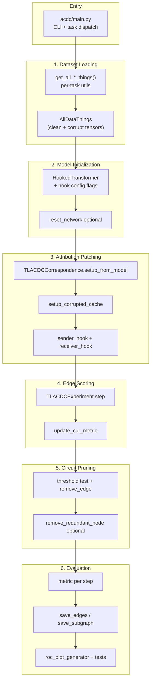

# ACDC Repository Execution Flow

This repository implements **Automatic Circuit DisCovery (ACDC)** — a greedy path-patching algorithm that discovers minimal transformer circuits by ablating edges in a hook-level computational graph. The primary entry point is `[acdc/main.py](acdc/main.py)`.

**Note:** "Attribution patching" in the user's request maps to **path patching** in this codebase (hook-based clean/corrupt activation mixing), implemented in `[acdc/TLACDCExperiment.py](acdc/TLACDCExperiment.py)`. This is distinct from TransformerLens's generic activation patching in the vendored `subnetwork_probing/` copy.

---

## High-Level Flow




---

## Stage 1: Dataset Loading

**Purpose:** Build clean validation tensors (`validation_data`) and corrupted reference tensors (`validation_patch_data`) for path patching, plus task-specific labels/masks and metrics.

**Central type:** `AllDataThings` in `[acdc/docstring/utils.py](acdc/docstring/utils.py)` (lines 43–50) — shared across all tasks.

**Dispatch in `[acdc/main.py](acdc/main.py)` (lines 232–296):**


| Task                                 | Factory                        | Data source                         |
| ------------------------------------ | ------------------------------ | ----------------------------------- |
| `ioi`                                | `get_all_ioi_things()`         | Procedural prompts via `IOIDataset` |
| `induction`                          | `get_all_induction_things()`   | Pre-tokenized HF Hub tensors        |
| `docstring`                          | `get_all_docstring_things()`   | Procedural docstring prompts        |
| `greaterthan`                        | `get_all_greaterthan_things()` | Procedural year prompts             |
| `tracr-reverse` / `tracr-proportion` | `get_all_tracr_things()`       | Synthetic permutations              |
| `or_gate`                            | `get_all_logic_gate_things()`  | Constant dummy input                |


**Files involved:**


| File                                                     | Role                                                                                     |
| -------------------------------------------------------- | ---------------------------------------------------------------------------------------- |
| `[acdc/main.py](acdc/main.py)`                           | CLI args (`--task`, `--metric`, `num_examples`, `seq_len`); dispatches to task factories |
| `[acdc/docstring/utils.py](acdc/docstring/utils.py)`     | `AllDataThings` dataclass definition                                                     |
| `[acdc/ioi/utils.py](acdc/ioi/utils.py)`                 | `get_all_ioi_things()` — tokenizes, splits train/val, builds corrupt prompts             |
| `[acdc/ioi/ioi_dataset.py](acdc/ioi/ioi_dataset.py)`     | `IOIDataset`, `gen_prompt_uniform()`, `gen_flipped_prompts()`                            |
| `[acdc/induction/utils.py](acdc/induction/utils.py)`     | `get_validation_data()`, `get_all_induction_things()` — loads `.pt`/`.pkl` from HF Hub   |
| `[acdc/docstring/prompts.py](acdc/docstring/prompts.py)` | `Prompt`, `BatchedPrompts`, `docstring_induction_prompt_generator()`                     |
| `[acdc/docstring/utils.py](acdc/docstring/utils.py)`     | `get_all_docstring_things()` — clean/corrupt prompt pairs                                |
| `[acdc/greaterthan/utils.py](acdc/greaterthan/utils.py)` | `GreaterThanConstants`, `get_year_data()`, `get_all_greaterthan_things()`                |
| `[acdc/tracr_task/utils.py](acdc/tracr_task/utils.py)`   | `create_model_input()`, `get_all_tracr_things()` — synthetic token grids                 |
| `[acdc/logic_gates/utils.py](acdc/logic_gates/utils.py)` | `get_all_logic_gate_things()` — hardcoded `[[0]]` input                                  |
| `[acdc/acdc_utils.py](acdc/acdc_utils.py)`               | `shuffle_tensor()` — used for induction corruption                                       |


**Output tensors passed forward:**

- `toks_int_values` = `things.validation_data` (clean `x`)
- `toks_int_values_other` = `things.validation_patch_data` (corrupted `x'`)

---

## Stage 2: Model Initialization

**Purpose:** Load a `HookedTransformer` with hook flags required for fine-grained graph construction and patching.

**Required config** (enforced in `TLACDCExperiment.verify_model_setup()`):

- `use_attn_result=True`
- `use_split_qkv_input=True`
- `use_hook_mlp_in=True` (when MLPs exist)

**Files involved:**


| File                                                     | Role                                                                                   |
| -------------------------------------------------------- | -------------------------------------------------------------------------------------- |
| `[acdc/ioi/utils.py](acdc/ioi/utils.py)`                 | `get_gpt2_small()` — `HookedTransformer.from_pretrained("gpt2")` + hook flags          |
| `[acdc/induction/utils.py](acdc/induction/utils.py)`     | `get_model()` — `HookedTransformer.from_pretrained("redwood_attn_2l")`                 |
| `[acdc/docstring/utils.py](acdc/docstring/utils.py)`     | `get_docstring_model()` — `HookedTransformer.from_pretrained("attn-only-4l")`          |
| `[acdc/greaterthan/utils.py](acdc/greaterthan/utils.py)` | Reuses `get_gpt2_small()` from IOI                                                     |
| `[acdc/tracr_task/utils.py](acdc/tracr_task/utils.py)`   | `get_tracr_model_input_and_tl_model()` — RASP/Tracr compile → manual `load_state_dict` |
| `[acdc/logic_gates/utils.py](acdc/logic_gates/utils.py)` | `get_logic_gate_model()` — hand-built tiny transformer                                 |
| `[acdc/acdc_utils.py](acdc/acdc_utils.py)`               | `reset_network()` — optional weight scrambling from HF Hub (`--reset-network=1`)       |
| `[acdc/__init__.py](acdc/__init__.py)`                   | `check_transformer_lens_version()` — requires `hook_mlp_in` support                    |
| `[acdc/main.py](acdc/main.py)`                           | Extracts `tl_model = things.tl_model`; calls `reset_network()` if flagged              |
| `[pyproject.toml](pyproject.toml)`                       | Pins `transformer-lens = 1.6.1`                                                        |


**External dependency:** `transformer_lens.HookedTransformer` (not in-repo).

---

## Stage 3: Attribution (Path) Patching

**Purpose:** Build the computational graph, cache clean/corrupt activations, and install forward hooks that mix activations along present edges.

**Initialization chain** in `TLACDCExperiment.__init__()` (`[acdc/TLACDCExperiment.py](acdc/TLACDCExperiment.py)`):

1. `verify_model_setup()` — assert hook flags
2. `TLACDCCorrespondence.setup_from_model(model)` — build full hook-level DAG
3. `reverse_topologically_sort_corr()` — order nodes output → input
4. `GlobalCache()` — allocate `online_cache` + `corrupted_cache`
5. `setup_corrupted_cache()` — forward pass on `ref_ds` (or zero-ablation) to fill corrupt cache
6. `setup_model_hooks(add_sender_hooks=True)` — attach `sender_hook` on all graph nodes
7. `update_cur_metric(initial=True)` — baseline metric ≈ 0 (full circuit present)

**Patching mechanics:**

- `**sender_hook`** — caches activations to `online_cache` (clean forward) or `corrupted_cache`
- `**receiver_hook**` — for each receiver hook point:
  - **ADDITION edges** (residual stream): start from corrupt, add `(clean − corrupt)` per present parent
  - **DIRECT_COMPUTATION edges** (Q/K/V): overwrite with clean when edge present
  - **PLACEHOLDER edges** — structural only, always kept

**Files involved:**


| File                                                           | Role                                                                                                                 |
| -------------------------------------------------------------- | -------------------------------------------------------------------------------------------------------------------- |
| `[acdc/TLACDCExperiment.py](acdc/TLACDCExperiment.py)`         | `sender_hook`, `receiver_hook`, `setup_corrupted_cache`, `setup_model_hooks`, `add_sender_hook`, `add_receiver_hook` |
| `[acdc/TLACDCCorrespondence.py](acdc/TLACDCCorrespondence.py)` | `setup_from_model()` — builds graph from last layer toward embeddings; `add_node`, `add_edge`                        |
| `[acdc/TLACDCEdge.py](acdc/TLACDCEdge.py)`                     | `Edge`, `EdgeType` (ADDITION, DIRECT_COMPUTATION, PLACEHOLDER), `TorchIndex`                                         |
| `[acdc/TLACDCInterpNode.py](acdc/TLACDCInterpNode.py)`         | `TLACDCInterpNode` — graph node = `(hook_name, TorchIndex)`                                                          |
| `[acdc/global_cache.py](acdc/global_cache.py)`                 | `GlobalCache` — `online_cache` + `corrupted_cache` dicts                                                             |
| `[acdc/acdc_utils.py](acdc/acdc_utils.py)`                     | `make_nd_dict()`, `OrderedDefaultdict` — nested edge index structures                                                |
| `[acdc/main.py](acdc/main.py)`                                 | Instantiates `TLACDCExperiment(model, ds, ref_ds, metric, threshold, ...)`                                           |


---

## Stage 4: Edge Scoring

**Purpose:** For each incoming edge to the current node, ablate it and measure the change in the validation metric. The score is stored as `edge.effect_size`.

**Core loop:** `TLACDCExperiment.step()` in `[acdc/TLACDCExperiment.py](acdc/TLACDCExperiment.py)`:

```
for each parent edge into current_node:
    skip if PLACEHOLDER
    edge.present = False                    # ablate
    add receiver_hook(current_node)
    add sender_hook(parent) if ADDITION
    evaluated_metric = update_cur_metric()  # forward pass with patched subgraph
    edge.effect_size = evaluated_metric - old_metric
    if effect_size < threshold: remove_edge()
    else: edge.present = True                 # keep
increment_current_node()
```

**Metric evaluation:** `update_cur_metric()` runs `self.model(self.ds)` with hooks active, then `self.cur_metric = self.metric(logits)`.

**Files involved:**


| File                                                     | Role                                                                                                |
| -------------------------------------------------------- | --------------------------------------------------------------------------------------------------- |
| `[acdc/TLACDCExperiment.py](acdc/TLACDCExperiment.py)`   | `step()`, `update_cur_metric()`, `increment_current_node()`, `current_node_connected()`             |
| `[acdc/acdc_utils.py](acdc/acdc_utils.py)`               | `kl_divergence`, `negative_log_probs`, `MatchNLLMetric`, `logit_diff_metric`, `frac_correct_metric` |
| `[acdc/ioi/utils.py](acdc/ioi/utils.py)`                 | Task metrics: `kl_div`, `logit_diff`, `frac_correct`, `nll`, `match_nll`                            |
| `[acdc/induction/utils.py](acdc/induction/utils.py)`     | Task metrics: `kl_div`, `nll`, `match_nll`                                                          |
| `[acdc/docstring/utils.py](acdc/docstring/utils.py)`     | Task metrics: `kl_div`, `docstring_metric`, `docstring_stefan`, `nll`, `match_nll`                  |
| `[acdc/greaterthan/utils.py](acdc/greaterthan/utils.py)` | Task metrics: `greaterthan`, `kl_div`                                                               |
| `[acdc/tracr_task/utils.py](acdc/tracr_task/utils.py)`   | Task metrics: `kl_div`, `l2`                                                                        |
| `[acdc/logic_gates/utils.py](acdc/logic_gates/utils.py)` | Task-specific validation + `kl_div`                                                                 |
| `[acdc/acdc_graphics.py](acdc/acdc_graphics.py)`         | `show()` — edge width ∝ `effect_size`; `log_metrics_to_wandb()`                                     |
| `[acdc/main.py](acdc/main.py)`                           | Main loop: `for i in range(max_num_epochs): exp.step()`                                             |


---

## Stage 5: Circuit Pruning

**Purpose:** Permanently remove edges whose ablation effect falls below `--threshold`; optionally prune unreachable subgraphs.

**Primary pruning** (inside `step()`):

- `result < threshold` → `corr.remove_edge(child, child_index, parent, parent_index)`
- `result >= threshold` → `edge.present = True` (edge kept in circuit)

**Secondary pruning** (optional, `remove_redundant=True`):

- `remove_redundant_node()` — BFS cleanup of dead nodes with no kept incoming edges

**Disconnected node skipping:**

- `increment_current_node()` skips nodes with no present outgoing edges

**Files involved:**


| File                                                           | Role                                                                          |
| -------------------------------------------------------------- | ----------------------------------------------------------------------------- |
| `[acdc/TLACDCExperiment.py](acdc/TLACDCExperiment.py)`         | Threshold decision in `step()`; `remove_redundant_node()`; `count_no_edges()` |
| `[acdc/TLACDCCorrespondence.py](acdc/TLACDCCorrespondence.py)` | `remove_edge()`, `count_no_edges()`, `all_edges()`                            |
| `[acdc/TLACDCEdge.py](acdc/TLACDCEdge.py)`                     | `Edge.present`, `Edge.effect_size` state                                      |
| `[acdc/main.py](acdc/main.py)`                                 | `--threshold` CLI arg; loop until `exp.current_node is None`                  |


**Circuit size metric:** `count_no_edges()` counts edges where `present=True` and `edge_type != PLACEHOLDER`.

---

## Stage 6: Evaluation

**Purpose:** Measure circuit quality during discovery, persist results, and (for paper reproduction) compare against canonical circuits.

### Runtime evaluation (during discovery)

- Every `step()` evaluates metric after each edge ablation
- `log_metrics_to_wandb()` logs metric trajectories, edge counts, graph images
- `show()` generates Graphviz circuit diagrams to `ims/`

### Post-discovery persistence

- `save_edges("edges.pkl")` — pickle present edges + effect sizes
- `save_subgraph()` — dict mapping edge tuples → `present` bool
- W&B artifact upload when `--using-wandb`

### Post-hoc / paper evaluation

- `[notebooks/roc_plot_generator.py](notebooks/roc_plot_generator.py)` — W&B runs → JSON Pareto/ROC points
- `[notebooks/make_plotly_plots.py](notebooks/make_plotly_plots.py)` — JSON → paper figures
- `[acdc/acdc_utils.py](acdc/acdc_utils.py)` — `get_node_stats`, `get_edge_stats`, `get_present_nodes` (precision/recall vs. canonical)

**Files involved:**


| File                                                                                 | Role                                                                          |
| ------------------------------------------------------------------------------------ | ----------------------------------------------------------------------------- |
| `[acdc/TLACDCExperiment.py](acdc/TLACDCExperiment.py)`                               | `save_edges()`, `save_subgraph()`, `load_subgraph()`, `load_from_wandb_run()` |
| `[acdc/acdc_utils.py](acdc/acdc_utils.py)`                                           | Recovery metrics vs. canonical circuits                                       |
| `[acdc/acdc_graphics.py](acdc/acdc_graphics.py)`                                     | Visualization + W&B logging                                                   |
| `[acdc/main.py](acdc/main.py)`                                                       | Saves edges/subgraph; W&B artifact upload                                     |
| `[tests/acdc/test_acdc.py](tests/acdc/test_acdc.py)`                                 | Integration tests; hardcoded `effect_size` regression                         |
| `[tests/acdc/test_greaterthan.py](tests/acdc/test_greaterthan.py)`                   | Greater-than task tests                                                       |
| `[notebooks/roc_plot_generator.py](notebooks/roc_plot_generator.py)`                 | W&B → JSON aggregation                                                        |
| `[notebooks/make_plotly_plots.py](notebooks/make_plotly_plots.py)`                   | JSON → Plotly figures                                                         |
| `[notebooks/auc_tables.py](notebooks/auc_tables.py)`                                 | AUC tables from plot data                                                     |
| `[experiments/collect_data.py](experiments/collect_data.py)`                         | Batch wrapper for ROC data collection                                         |
| `[experiments/results/canonical_circuits/](experiments/results/canonical_circuits/)` | Ground-truth circuit `.gv` files for comparison                               |


---

## Complete File Inventory (Core Pipeline)

### Core ACDC package (19 files)

```
acdc/
├── __init__.py              # TransformerLens version check
├── main.py                  # PRIMARY ENTRY POINT
├── TLACDCExperiment.py      # Algorithm engine (patching, scoring, pruning)
├── TLACDCCorrespondence.py  # Graph construction + edge CRUD
├── TLACDCEdge.py            # Edge, EdgeType, TorchIndex
├── TLACDCInterpNode.py      # Graph node
├── global_cache.py          # Activation caches
├── acdc_utils.py            # Metrics, helpers, reset_network
├── acdc_graphics.py         # Graphviz viz, W&B logging
├── ioi/
│   ├── utils.py             # get_all_ioi_things, get_gpt2_small
│   └── ioi_dataset.py       # IOIDataset, prompt generation
├── induction/utils.py       # get_all_induction_things, HF Hub data
├── docstring/
│   ├── utils.py             # AllDataThings, get_all_docstring_things
│   └── prompts.py           # Docstring prompt generation
├── greaterthan/utils.py     # get_all_greaterthan_things
├── tracr_task/utils.py      # get_all_tracr_things, Tracr model port
└── logic_gates/utils.py     # get_all_logic_gate_things
```

### Tests

```
tests/acdc/
├── test_acdc.py             # All-task loader + effect_size regression
└── test_greaterthan.py      # Greater-than specific tests
```

### Experiment orchestration (optional, paper reproduction)

```
experiments/
├── launch_induction.py      # Grid launcher → acdc/main.py
├── launch_spreadsheet.py    # Multi-task ACDC grid
├── launch_docstring.py      # Docstring sweeps
├── launcher.py              # Subprocess/Kubernetes runner
├── collect_data.py          # Batch ROC data collection
└── results/
    ├── canonical_circuits/  # Ground-truth circuits
    └── plots_data/          # JSON for plotting
```

### Notebooks / demos (optional)

```
notebooks/
├── roc_plot_generator.py    # W&B → JSON
├── make_plotly_plots.py     # JSON → figures
├── auc_tables.py            # AUC tables
├── editing_edges.py         # Edge editing demo
├── implementation_demo.py   # Low-level graph demo
└── colabs/                  # Colab notebook versions
```

### Config / docs

```
pyproject.toml               # Dependencies (transformer-lens 1.6.1)
README.md                    # Installation, reproduction instructions
```

---

## End-to-End Call Chain (Single Run)

```
python acdc/main.py --task=induction --threshold=0.71 [--zero-ablation]

1. argparse → TASK, THRESHOLD, DEVICE, etc.
2. get_all_induction_things(num_examples, seq_len, device, metric)
     → AllDataThings(tl_model, validation_data, validation_patch_data, validation_metric)
3. [optional] reset_network(TASK, DEVICE, tl_model)
4. TLACDCExperiment(model, ds, ref_ds, metric, threshold, ...)
     → setup_from_model → setup_corrupted_cache → setup_model_hooks → update_cur_metric
5. for i in range(max_num_epochs):
     exp.step()           # edge scoring + pruning
     show(corr, png)      # visualization
     break if current_node is None
6. exp.save_edges("edges.pkl")
   exp.save_subgraph()
   [wandb artifact upload]
```

---

## Key Design Patterns

- **No external dataset config files** — task selection via CLI `--task`; data built procedurally or loaded from HF Hub
- **Two tensor streams** — clean (`ds`) and corrupted (`ref_ds`) for path patching
- **Greedy reverse-topological pruning** — process nodes output → input; remove edges below threshold
- **Metric minimization** — ACDC minimizes the chosen metric; pass negative if maximizing
- **PLACEHOLDER edges** — structural (Q/K/V → hook_result); never scored or pruned

